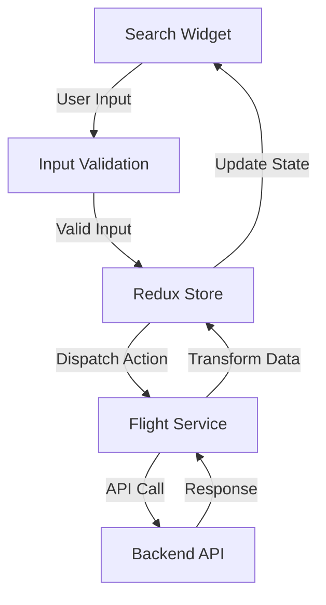
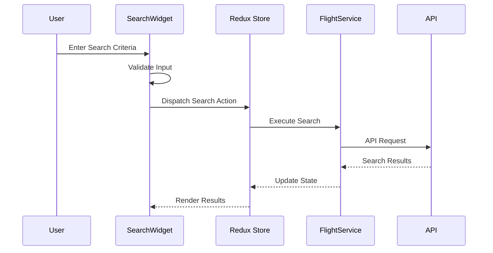
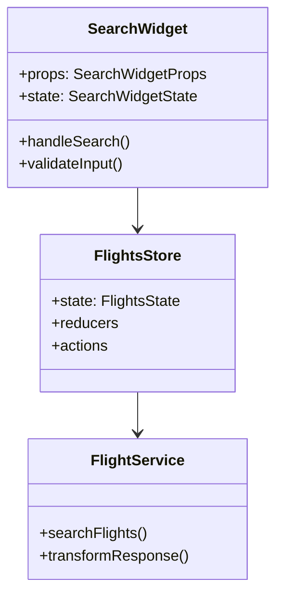

# Technical Design: AIR-9734

## Overview
The Search Widget Enhancement Part 2 focuses on improving the existing flight search functionality by implementing advanced search features, optimizing performance, and enhancing the user experience. This update will modify the search widget component, its associated services, and state management to support new search capabilities while maintaining backward compatibility.

## Architecture
The solution follows a React-based frontend architecture using Redux for state management, TypeScript for type safety, and styled-components for styling. The architecture maintains a clear separation of concerns between UI components, business logic, and data management. The search functionality will be implemented using a service layer pattern that abstracts API interactions.

## Components

### SearchWidget
Main search component handling user input and search initialization

**Responsibilities:**
- Handle user input for search parameters
- Validate search criteria
- Dispatch search actions
- Manage local component state
- Display search form UI

**Interfaces:**
- interface SearchWidgetProps { onSearch: (criteria: SearchCriteria) => void; }
- interface SearchCriteria { origin: string; destination: string; dates: DateRange; }

### FlightSearchService
Service layer handling flight search API interactions

**Responsibilities:**
- Execute flight search API calls
- Transform API responses
- Handle search errors
- Cache search results

**Interfaces:**
- interface SearchResponse { flights: Flight[]; metadata: SearchMetadata; }
- interface SearchParams { searchCriteria: SearchCriteria; filters: SearchFilters; }

### FlightsStore
Redux store slice for flight search state management

**Responsibilities:**
- Manage search state
- Handle search actions
- Store search results
- Track loading states

**Interfaces:**
- interface FlightsState { results: Flight[]; loading: boolean; error?: string; }
- interface SearchActions { search: ActionCreator; updateResults: ActionCreator; }

## Data Flow

## Sequence Diagram

## Class Structure

## Affected Areas

- src/components/flights/SearchWidget/index.tsx
- src/components/flights/SearchWidget/styles.ts
- src/components/flights/SearchWidget/types.ts
- src/store/flights/actions.ts
- src/store/flights/reducers.ts
- src/services/flights/search.ts
- src/components/flights/SearchResults/index.tsx

## Dependencies

- react@^17.0.0
- redux@^4.0.0
- styled-components@^5.0.0
- typescript@^4.0.0
- axios@^0.21.0

## Implementation Steps

1. Review and update SearchWidget component structure
2. Implement new search functionality in FlightService
3. Update Redux store with new actions and reducers
4. Add input validation and error handling
5. Implement caching mechanism for search results
6. Update styling and UI components
7. Add unit tests for new functionality
8. Update integration tests for search flow
9. Perform performance optimization
10. Update documentation

## Risks & Mitigation

- Breaking changes to existing search implementations
- Performance degradation with complex search criteria
- Increased API load with new search features
- Browser compatibility issues with new UI components
- State management complexity with additional features

## Testing Strategy

Testing will be implemented at multiple levels:
1. Unit tests for individual components using Jest and React Testing Library
2. Integration tests for the complete search flow
3. Performance testing for search operations
4. Browser compatibility testing
5. E2E tests using Cypress
6. API integration tests
7. State management tests for Redux store
8. Accessibility testing

---

*Generated automatically by Jira Technical Design Agent*
*Date: 2025-10-06T08:10:15.501Z*
