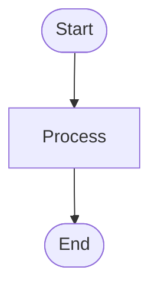
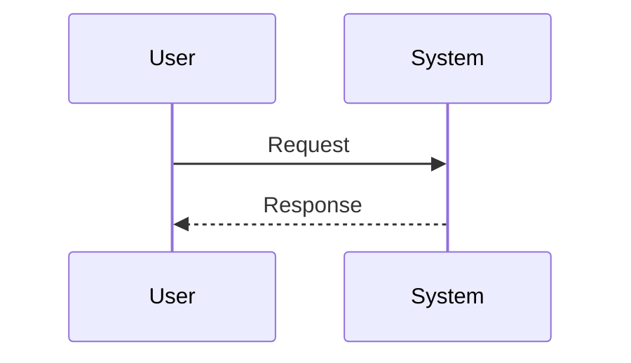
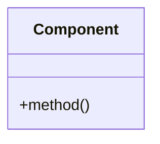

# Technical Design: AIR-9960

## Overview
Technical design for Create MCP for low level system design for JIRA tickets

## Architecture
Architecture details to be defined

## Components

## Data Flow

## Sequence Diagram

## Class Structure

## Affected Areas

## Dependencies

## Implementation Steps

1. Analyze requirements and design
2. Implement core functionality
3. Add tests
4. Update documentation
5. Code review and deployment

## Risks & Mitigation

- Technical complexity
- Integration challenges

## Testing Strategy

Unit tests, integration tests, and manual testing required

---

*Generated automatically by Jira Technical Design Agent*
*Date: 2025-10-05T20:40:16.495Z*
