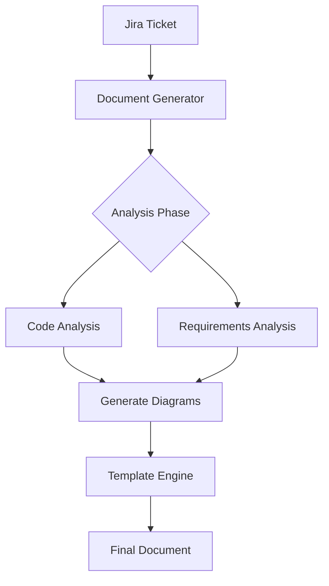
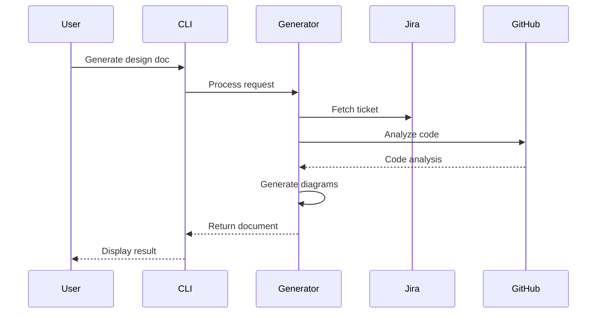
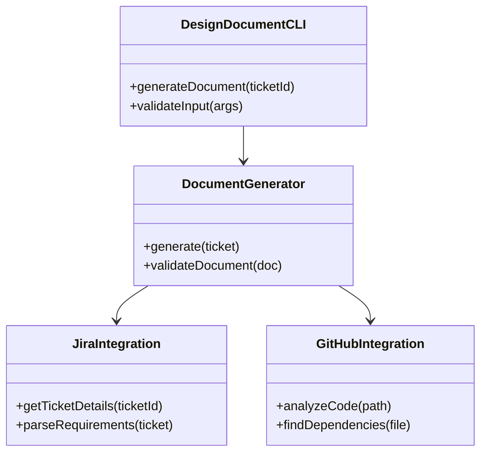

# Technical Design: AIR-9960

## Overview
The MCP System Design Document Generator is a tool that automates the creation of comprehensive technical design documents from Jira tickets. It integrates with Jira and GitHub APIs to gather requirements, analyze code, and generate structured design documentation including architecture diagrams, component specifications, and implementation plans.

## Architecture
The system follows a modular architecture with clear separation of concerns:
1. CLI Interface Layer - Handles user input and command processing
2. Core Service Layer - Orchestrates the document generation process
3. Integration Layer - Manages external API interactions (Jira, GitHub)
4. Template Engine - Handles document structure and formatting
5. Diagram Generator - Creates technical diagrams using Mermaid syntax

## Components

### DesignDocumentCLI
Command-line interface for initiating document generation

**Responsibilities:**
- Parse command line arguments
- Validate input parameters
- Display progress and results

**Interfaces:**
- generateDocument(ticketId: string): Promise<void>
- validateInput(args: string[]): boolean

### DocumentGenerator
Core service for generating technical design documents

**Responsibilities:**
- Coordinate document generation workflow
- Aggregate information from different sources
- Apply document templates
- Generate final output

**Interfaces:**
- generate(ticket: JiraTicket): Promise<Document>
- validateDocument(doc: Document): boolean

### JiraIntegration
Handles interaction with Jira API

**Responsibilities:**
- Fetch ticket details
- Parse ticket information
- Extract requirements

**Interfaces:**
- getTicketDetails(ticketId: string): Promise<JiraTicket>
- parseRequirements(ticket: JiraTicket): Requirements

### GitHubIntegration
Manages GitHub repository interactions

**Responsibilities:**
- Analyze code structure
- Identify dependencies
- Search relevant code

**Interfaces:**
- analyzeCode(path: string): Promise<CodeAnalysis>
- findDependencies(file: string): Promise<Dependency[]>

## Data Flow

## Sequence Diagram

## Class Structure

## Affected Areas

- src/cli - New CLI command implementation
- src/helpers - Document generation utilities
- src/types - Type definitions for design documents
- src/utils - Integration utilities

## Dependencies

- commander.js - CLI framework
- axios - HTTP client for API calls
- mermaid.js - Diagram generation
- handlebars - Template engine
- yaml - Configuration parsing

## Implementation Steps

1. Set up project structure and base configuration
2. Implement Jira integration service
3. Create GitHub integration service
4. Develop core document generator service
5. Build CLI interface
6. Implement template engine
7. Add diagram generation functionality
8. Create document validation system
9. Add error handling and logging
10. Write comprehensive tests

## Risks & Mitigation

- API rate limiting from Jira and GitHub
- Complex diagrams may not render correctly
- Template maintenance could become challenging
- Performance issues with large code bases
- Integration points might break with API changes

## Testing Strategy

Testing strategy includes:
1. Unit tests for each component
2. Integration tests for API interactions
3. End-to-end tests for complete workflow
4. Template validation tests
5. Diagram generation tests
6. CLI argument parsing tests
7. Error handling tests
8. Performance tests for large repositories

---

*Generated automatically by Jira Technical Design Agent*
*Date: 2025-10-05T20:27:26.006Z*
