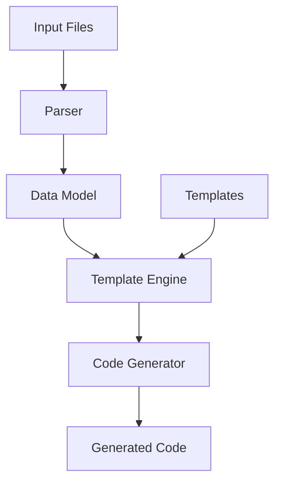
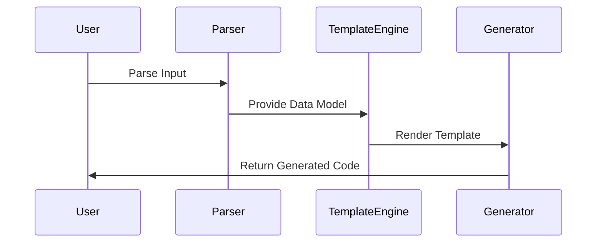
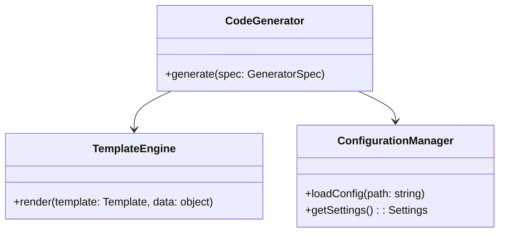

# Technical Design: AIR-9961

## Overview
The MCP Tools Code Generator is a system designed to automate code generation for MCP tools. It will provide a flexible, template-based approach to generate consistent and maintainable code across the MCP toolset.

## Architecture
The system follows a modular architecture with three main layers: Input Processing, Template Engine, and Code Generation. It uses the Template Method pattern for code generation workflows and the Strategy pattern for different output formats.

## Components

### ConfigurationManager
Handles all configuration aspects of the code generator

**Responsibilities:**
- Load and validate configuration files
- Manage template paths
- Store generation settings

**Interfaces:**
- loadConfig(path: string): Config
- getTemplatePath(): string
- getOutputSettings(): OutputSettings

### TemplateEngine
Core template processing and rendering engine

**Responsibilities:**
- Load template files
- Parse template syntax
- Render templates with data

**Interfaces:**
- loadTemplate(name: string): Template
- render(template: Template, data: object): string

### CodeGenerator
Main code generation orchestrator

**Responsibilities:**
- Coordinate generation process
- Apply transformations
- Write output files

**Interfaces:**
- generate(spec: GeneratorSpec): void
- validateOutput(code: string): boolean

## Data Flow

## Sequence Diagram

## Class Structure

## Affected Areas

- MCP tools infrastructure
- Build system integration
- CI/CD pipelines
- Development workflows

## Dependencies

- Template engine library (e.g., Handlebars, EJS)
- File system access library
- YAML/JSON parser
- Code formatting tools

## Implementation Steps

1. Set up basic project structure and build system
2. Implement ConfigurationManager for settings handling
3. Create core TemplateEngine implementation
4. Develop CodeGenerator orchestrator
5. Add template loading and validation
6. Implement code generation pipeline
7. Add output validation and formatting
8. Create CLI interface
9. Add documentation and examples
10. Set up testing infrastructure

## Risks & Mitigation

- Template maintenance complexity as the number of templates grows
- Performance impact with large-scale code generation
- Integration challenges with existing build processes
- Potential for generated code conflicts
- Learning curve for template development

## Testing Strategy

Testing will be implemented at multiple levels:
1. Unit tests for each component
2. Integration tests for the complete generation pipeline
3. Snapshot testing for generated code
4. Performance tests for large-scale generation
5. Template validation tests
6. End-to-end tests with actual MCP tools scenarios

---

*Generated automatically by Jira Technical Design Agent*
*Date: 2025-10-05T20:38:03.081Z*
